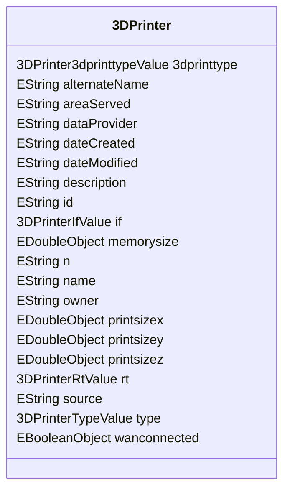

```mermaid 
classDiagram
 class 3DPrinter {
 3DPrinter3dprinttypeValue 3dprinttype
 EString alternateName
 EString areaServed
 EString dataProvider
 EString dateCreated
 EString dateModified
 EString description
 EString id
 3DPrinterIfValue if
 EDoubleObject memorysize
 EString n
 EString name
 EString owner
 EDoubleObject printsizex
 EDoubleObject printsizey
 EDoubleObject printsizez
 3DPrinterRtValue rt
 EString source
 3DPrinterTypeValue type
 EBooleanObject wanconnected

}
```
