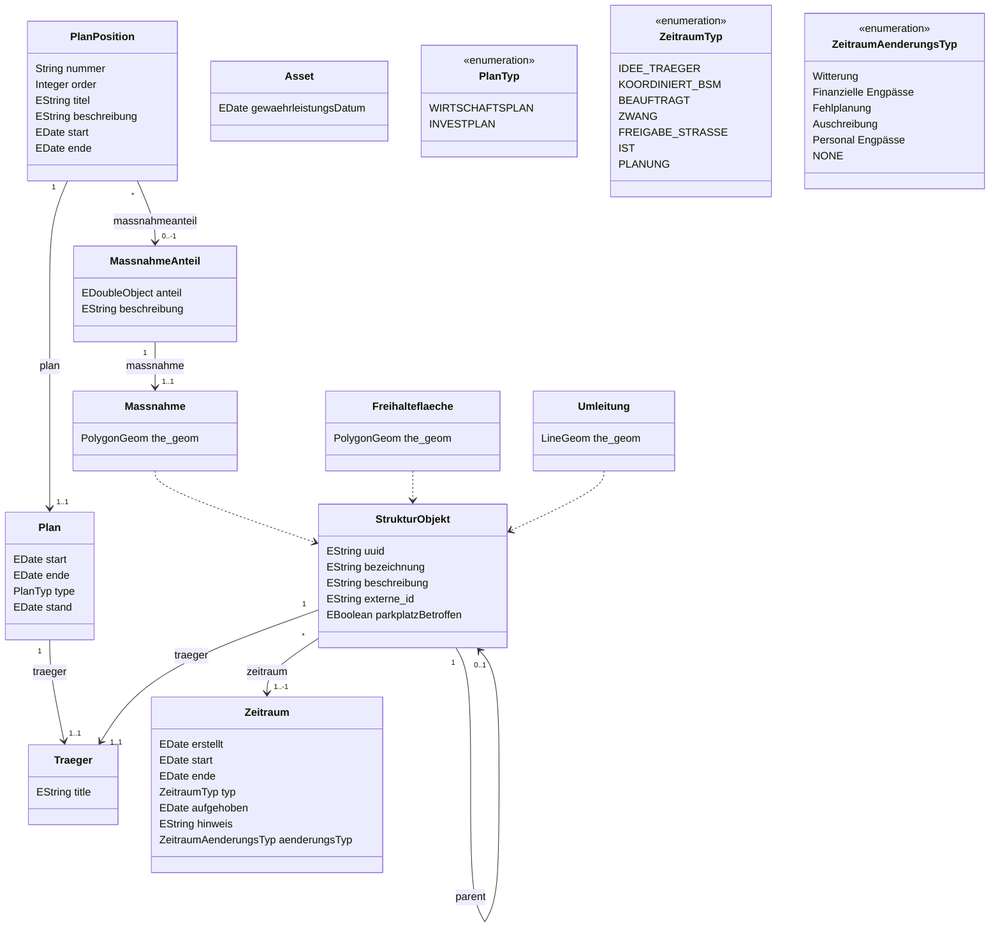

```mermaid 
classDiagram
 class Plan {
 EDate start
 EDate ende
 PlanTyp type
 EDate stand
}

 Plan "1" -->  "1..1" Traeger : traeger

 class PlanPosition {
 String nummer
 Integer order
 EString titel
 EString beschreibung
 EDate start
 EDate ende
}

 PlanPosition "1" -->  "1..1" Plan : plan
 PlanPosition  "*" -->  "0..-1" MassnahmeAnteil : massnahmeanteil

 class MassnahmeAnteil {
 EDoubleObject anteil
 EString beschreibung
}

 MassnahmeAnteil "1" -->  "1..1" Massnahme : massnahme

 class StrukturObjekt {
 EString uuid
 EString bezeichnung
 EString beschreibung
 EString externe_id
 EBoolean parkplatzBetroffen
}

 StrukturObjekt "1" -->  "0..1" StrukturObjekt : parent
 StrukturObjekt "1" -->  "1..1" Traeger : traeger
 StrukturObjekt  "*" -->  "1..-1" Zeitraum : zeitraum

 class Traeger {
 EString title
}


 class Zeitraum {
 EDate erstellt
 EDate start
 EDate ende
 ZeitraumTyp typ
 EDate aufgehoben
 EString hinweis
 ZeitraumAenderungsTyp aenderungsTyp
}


 class Massnahme {
 PolygonGeom the_geom
}


 Massnahme ..> StrukturObjekt

 class Freihalteflaeche {
 PolygonGeom the_geom
}


 Freihalteflaeche ..> StrukturObjekt

 class Umleitung {
 LineGeom the_geom
}


 Umleitung ..> StrukturObjekt

 class Asset {
 EDate gewaehrleistungsDatum
}


 class PlanTyp {
 <<enumeration>>
 WIRTSCHAFTSPLAN
 INVESTPLAN
}

 class ZeitraumTyp {
 <<enumeration>>
 IDEE_TRAEGER
 KOORDINIERT_BSM
 BEAUFTRAGT
 ZWANG
 FREIGABE_STRASSE
 IST
 PLANUNG
}

 class ZeitraumAenderungsTyp {
 <<enumeration>>
 Witterung
 Finanzielle Engpässe
 Fehlplanung
 Auschreibung
 Personal Engpässe
 NONE
}

```
